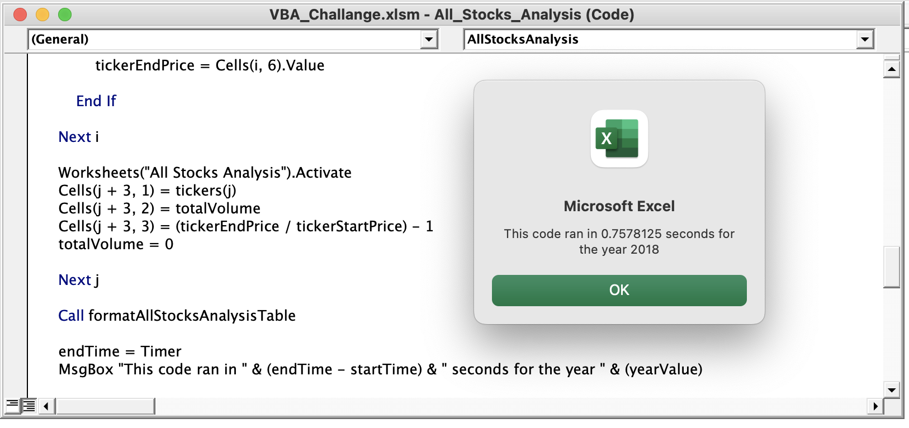
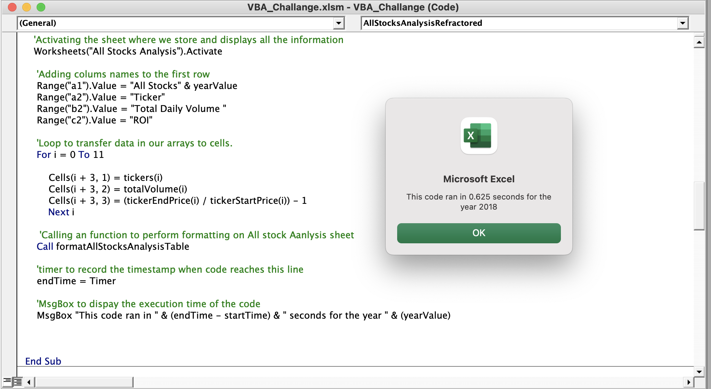
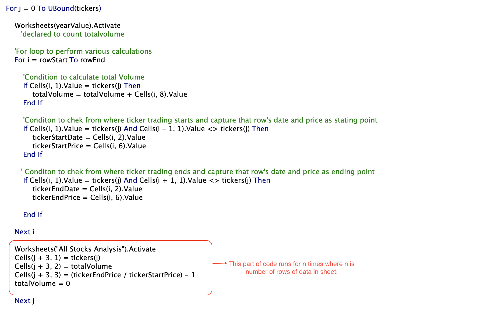
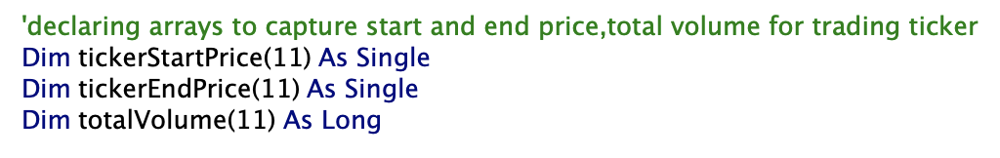
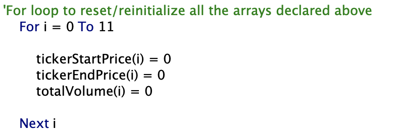
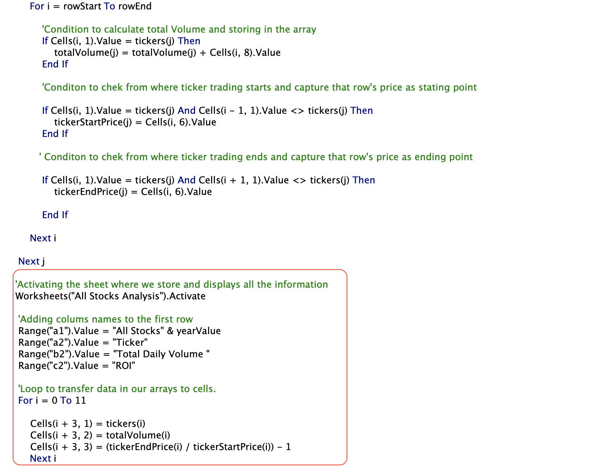

# VBA_challange
Challange work done to make the modules run faster than before by refractoring the code

# Overview
We are working on stock analysis project for Steve,helping him analyse the stocks he traded in last two tears i.e 2017 and 2018 for his parents. While working on the analysis,steve wanted to analyse data by click of button.We created macro which does the analysis of all stocks for a particular year which is input by the user,Steve.This whole work was done in our Module 2 of this stock analysis project. In this challange assignment,we will doing some refactor operation on our code to make it run faster.To check the performace of our code,we will be using timer to record the execution time of our code.

# Results
The screenshots tells all the difference in runtime.The refactor code runs significantly faster than our code done in module 2.

--This is the time withour refactoring for year 2018

-- This one is after refactoring the same code for year 2018

# Refactor process Summary
The basic of any coding practice is to make code runs efficiently,generates good quality of code,saves time,easy to understand etc.

We did some research online on our basic to figure out major things which impacts the code performance.
One of the thing is to look for to is to avoid the data update cycle. In module 2 code,the cells values are updating after during every iteration of the loop.This mean switching between data(2017 or 2018) and analysis sheet every time .This happens for n times where n is number of data rows in a sheet. 

To avoid that and make code run faster,we needed something to store the values locally and trasferring to cells in stock analysis sheet in on go. For that we created arrays to store values.

*tickerTotalVolume()

*tickerStartingPrice()

*tickerEndingPrice() 

The size of these arrays are same as the size of ticker array i.e 12. We set the values of these arrays to 0 using for loop.This loop runs every time we run our code and resets the values stored in array from previously ran code.

All the values related to each ticker in ticker array is stored at same index in tickerTotalVolume,tickerStartingPrice and tickerEndingPrice arrays.
After getting all the values in arrays,we activate our "All Stocks Analysis" worksheet and transfer all the values to the respective cells.We did that using for loop from 0 to 11 i.e size of array and transferred data to cells. 

In this code,we worked on data sheet and stored the values in arrays.Next step is to switching to analysis sheet and transfer our data.Note in this case,we are only switchinng once to do trasnfer analysis data to cells.So,we saved n-1 time of steps our system has to go through in Module 2 .This is where we save our run-time.

## Advantages

-- The main advantage of doing refactoring is maintainability.The code looks fresher,easy to understand,less complex and well orgainzed.

-- It saves run-time of the code.We avoid having the code writes into sheet on every iteration,thus saves time.

## Disadvantages

-- The disadvantage of refactoring process is that it is time consuming process.Things get worse when the project is very big.

-- Another is money,refactoring may cause things to go out of budget.

-- It is not easy to do refactoring when the person who develops and refactor are not same.It can cause miss deadlines and errors in software developement life cycle.
